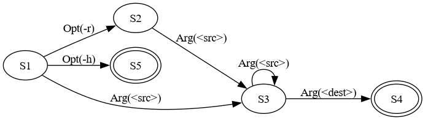

# Usage Strings

[Guide](index.md) ·
[API reference](https://squattingmonk.github.io/argumint/argumint.html)

A **usage string** describes the command lines your program accepts. argumint
writes one from your spec, but you can write your own to say exactly what's
allowed. It isn't just text for help: argumint checks the command line against
it, so whatever the usage string allows is what's accepted, and nothing else.

```nim
import argumint

let spec = (
  src: args("<src>", help = "Files to copy"),
  dest: arg("<dest>", help = "Where to copy them"),
  recursive: flag("-r, --recursive", help = "Copy directories too"),
  help: help(),
)

spec.parseOrQuit(usage = "[-r] <src>... <dest>")
echo "copy ", spec.src, " to ", spec.dest, if spec.recursive: " recursively" else: ""
```

This usage string says `-r` is optional, `<src>` takes one or more values, and
`<dest>` takes exactly one value at the end:

```console
$ ./cp a.txt b.txt backup/
copy @["a.txt", "b.txt"] to backup/
$ ./cp -r photos backup/
copy @["photos"] to backup/ recursively
$ ./cp a.txt
Parsing error:
  - missing argument: <dest>

Usage:
  cp [-r] <src>... <dest>
  cp (-h | --help)
```

The usage string leaves out the program's name. Help adds it to each line,
along with the help line argumint filled in for you.

## The Grammar

A usage string is made of these pieces:

- `<name>` or `NAME` is a [positional argument](args-and-options.md).
- `-o` or `--option` is an [option](args-and-options.md) or
  [flag](flags.md), by any of its names. Write `-o=<value>` or `-o=VALUE`
  to show the option's value placeholder in help.
- `-abc` is several short options at once, the same as `-a -b -c`.
- A plain word is a [command](commands.md). A word in capitals is a
  positional argument, so a command can't be spelled in capitals.
- `[...]` makes everything inside it optional.
- `(...)` groups pieces, so that `|` or `...` applies to the whole group.
- `a | b` means either `a` or `b`, but not both.
- `...` lets the piece before it repeat.
- `[options]` stands for any option not named elsewhere on the line.
- `--` makes everything after it a positional value.
- `{cmd}` stands for the program's name, at the start of a line. In a
  subcommand's usage string, it also includes the subcommand's name.

Everything inside one pair of brackets is optional as a whole, not piece by
piece. `[-a -b]` accepts both flags or neither, but not `-a` alone. Write
`[-a] [-b]` to make each one optional.

## Choosing Between Options

Use `|` when the user can give one thing or another, but not both:

```nim
import argumint

let spec = (
  file: arg("<file>", help = "File to open"),
  read: flag("-r, --read", help = "Open for reading"),
  write: flag("-w, --write", help = "Open for writing"),
  help: help(),
)

spec.parseOrQuit(usage = "<file> [--read | --write]")
echo "read=", spec.read, " write=", spec.write
```

```console
$ ./mode notes.txt --read
read=true write=false
$ ./mode notes.txt -r -w
Parsing error:
  - unexpected flag: -w

Usage:
  mode <file> [--read | --write]
  mode (-h | --help)
```

## More Than One Line

Each line of a usage string is a separate way to call your program. The
command line has to match one of them:

```nim
import argumint

let spec = (
  src: arg("<src>", help = "File to back up"),
  dest: arg("<dest>", help = "Where to put the backup"),
  list: flag("-l, --list", help = "List existing backups instead"),
  help: help(),
)

spec.parseOrQuit(usage = """
{cmd} <src> <dest>
{cmd} --list
""")
if spec.list:
  echo "Listing backups..."
else:
  echo "Backing up ", spec.src, " to ", spec.dest
```

```console
$ ./backup a.txt dest/
Backing up a.txt to dest/
$ ./backup --list
Listing backups...
$ ./backup --list a.txt
Parsing error:
  - unexpected argument: a.txt

Usage:
  backup <src> <dest>
  backup --list
  backup (-h | --help)
```

A single line like `[<src> <dest>] [--list]` would accept `--list a.txt`, and
also no arguments at all. Separate lines keep the two shapes apart.

Blank lines are ignored. An indented line continues the line before it, so a
long one can wrap.

## Repeating

`...` lets the piece before it repeat. What happens to the values depends on
the `Arg`:

- An `args` or `opts` keeps every value. Written without `...`, it takes
  exactly one.
- An `arg` or `opt` keeps only the last value.

`...` after a group repeats the whole group:

```nim
import argumint

let spec = (
  keys: args("<key>"),
  values: args("<value>"),
)

spec.parseOrQuit(usage = "(<key> <value>)...")
echo spec.keys, " ", spec.values
```

```console
$ ./pairs a 1 b 2
@["a", "b"] @["1", "2"]
$ ./pairs a 1 b
Parsing error:
  - unexpected argument: b

Usage:
  pairs (<key> <value>)...
```

## Catching the Other Options

`[options]` stands for every option not named elsewhere on the same line. An
option it covers can be given any number of times, and in any order:

```nim
import argumint

let spec = (
  name: opt("-n, --name=<name>", help = "Who to greet"),
  verbose: flag[int](ops = [flagOp("-v, --verbose", "+=", 1)], help = "Show more"),
  quiet: flag("-q, --quiet", help = "Show less"),
  help: help(),
)

spec.parseOrQuit(usage = "--name=<name> [options]")
echo "name=", spec.name, " verbose=", spec.verbose, " quiet=", spec.quiet
```

`--name` is named on the line, so it's required and can be given only once.
`-v` and `-q` are covered by `[options]`. Naming an option takes it out of
`[options]` only on that line, so another line's `[options]` still covers it.

```console
$ ./greet --name Ada -vvv -q
name=Ada verbose=3 quiet=true
$ ./greet --name=a --name=b
Parsing error:
  - unexpected option: --name=b

Usage:
  greet --name=<name> [options]
  greet (-h | --help)
```

## Where Options Can Go

Options can come in any order, and before, after, or between positional
arguments, no matter what order the usage string shows them in. A usage string
of `--foo --bar` also accepts `--bar --foo`. Only the positional arguments have
to stay in order:

```nim
import argumint

let spec = (
  files: args("<file>", help = "Files to process"),
  verbose: flag("-v, --verbose", help = "Show more"),
  help: help(),
)

spec.parseOrQuit(usage = "<file>... [options]")
echo "files=", spec.files, " verbose=", spec.verbose
```

```console
$ ./files a.txt -v b.txt
files=@["a.txt", "b.txt"] verbose=true
$ ./files -v a.txt b.txt
files=@["a.txt", "b.txt"] verbose=true
$ ./files a.txt b.txt -v
files=@["a.txt", "b.txt"] verbose=true
```

## The End of Options Marker

The user can type `--` to make everything after it a positional value, even if
it looks like an option or a command. This works with any usage string, such
as the `files` example above:

```console
$ ./files a.txt -- -v -x.txt
files=@["a.txt", "-v", "-x.txt"] verbose=false
```

Put `--` in the usage string itself and everything after that point is a
positional value, whether or not the user types `--`. This suits a program
that passes arguments on to another one:

```nim
import argumint

let spec = (
  prog: arg("<prog>", help = "Program to run"),
  rest: args("<arg>", help = "Arguments to pass it"),
  help: help(),
)

spec.parseOrQuit(usage = "<prog> -- <arg>...")
echo "prog=", spec.prog, " rest=", spec.rest
```

```console
$ ./run ls -l -a
prog=ls rest=@["-l", "-a"]
$ ./run ls -- -l
prog=ls rest=@["-l"]
```

After `--` in a usage line, only positional arguments can follow.

## Naming the Program

To write the program's name in a usage line, start the line with `{cmd}`. A
line that's only `{cmd}` lets the program run with no arguments at all:

```nim
import argumint

let spec = (
  file: arg("<file>", help = "File to show"),
  lines: opt("-n, --lines=<n>", default = 10, help = "Lines to show"),
  help: help(),
)

spec.parseOrQuit(usage = """
{cmd}
{cmd} <file> [-n=<n>]
""")
echo "file=", spec.file, " lines=", spec.lines
```

```console
$ ./show
file= lines=10
$ ./show notes.txt -n 3
file=notes.txt lines=3
$ ./show --help
Usage:
  show
  show <file> [-n=<n>]
  show (-h | --help)

Arguments:
  <file>           File to show

Options:
  -n, --lines=<n>  Lines to show [default: 10]
  -h, --help       Display this help message
```

`{cmd}` is optional on each line. A usage string built with `fmt` needs
`{{cmd}}`.

In a subcommand's usage string, `{cmd}` stands for the whole command path, such
as `notes add`. Don't write the subcommand's name after it.

## What argumint Fills In

You don't have to mention every `Arg` in your usage string. argumint adds a
line for anything the user couldn't otherwise reach:

- Positional arguments get one line, in the order you declared them, but only
  if your usage string mentions none of them. An `args` is written `<src>...`.
  If more than one `args` needs filling in, argumint can't tell how to split
  the values between them, so you have to write the line yourself.
- Commands share one line, like `(add | list)`.
- `help`, `version` and `message` each get a line of their own.
- Options that are left out are covered by `[options]` at the start of the
  first line argumint adds, or by a line of their own.
- If your spec has nothing but `help`, `version` or `message`, argumint also
  adds a line for the command on its own, so it can run with no arguments.

Go back to the copy example at the top of this page. Without a usage string,
argumint writes the whole thing:

```nim
spec.parseOrQuit()
```

```console
$ ./cp --help
Usage:
  cp [options] <src>... <dest>
  cp (-h | --help)

Arguments:
  <src>            Files to copy
  <dest>           Where to copy them

Options:
  -r, --recursive  Copy directories too
  -h, --help       Display this help message
```

With a usage string that leaves out `-r`, argumint adds an `[options]` line
for it. `<src>` is written without `...` here, so it takes exactly one value:

```nim
spec.parseOrQuit(usage = "<src> <dest>")
```

```console
$ ./cp --help
Usage:
  cp <src> <dest>
  cp [options]
  cp (-h | --help)

Arguments:
  <src>            Files to copy
  <dest>           Where to copy them

Options:
  -r, --recursive  Copy directories too
  -h, --help       Display this help message
```

## Mistakes in a Usage String

argumint checks every name in a usage string against your spec when it builds
the spec. A typo is a bug in your program, so it raises a `SpecDefect` before
any parsing happens:

```nim
import argumint

let spec = (
  file: arg("<file>"),
  verbose: flag("-v, --verbose"),
)

spec.parseOrQuit(usage = "[--verbos] <file>")
```

```console
$ ./typo
Error constructing spec: Error at (1:1): Undeclared option: --verbos
[--verbos] <file>
 ^
```

Writing the program's name without `{cmd}` is the same mistake, since argumint
reads it as an undeclared command:

```nim
spec.parseOrQuit(usage = "typo <file>")
```

```console
$ ./typo
Error constructing spec: Error at (1:0): Undeclared command: typo
typo <file>
^
```

A command can't be followed by anything else on the same line, because the
command takes the rest of the command line. Its arguments go in its own usage
string. See
[Usage Lines for a Command](commands.md#usage-lines-for-a-command).

## Seeing the State Machine

argumint compiles a usage string into a state machine, and matches the
command line by walking it. When a usage string doesn't behave the way you
expect, `dot` shows that machine as [Graphviz](https://graphviz.org/) source:

```nim
import argumint

let spec = (
  src: args("<src>", help = "Files to copy"),
  dest: arg("<dest>", help = "Where to copy them"),
  recursive: flag("-r, --recursive", help = "Copy directories too"),
  help: help(),
)

echo spec.dot(usage = "[-r] <src>... <dest>")
```

Graphviz's `dot` command turns that into a picture:

```console
$ ./cpdot | dot -Tpng -o cp.png
```



Start at `S1`. `-r` is optional, so `S1` can reach `S3` with or without it.
`<src>` loops on `S3`, and `<dest>` ends at `S4`. The `-h` branch to `S5` is
the help line argumint filled in. A state with a double border is where a
command line can end.

For a larger example, see the
[state machine for naval_fate.nim](../images/naval-fate-fsm.png), which
includes every subcommand.
