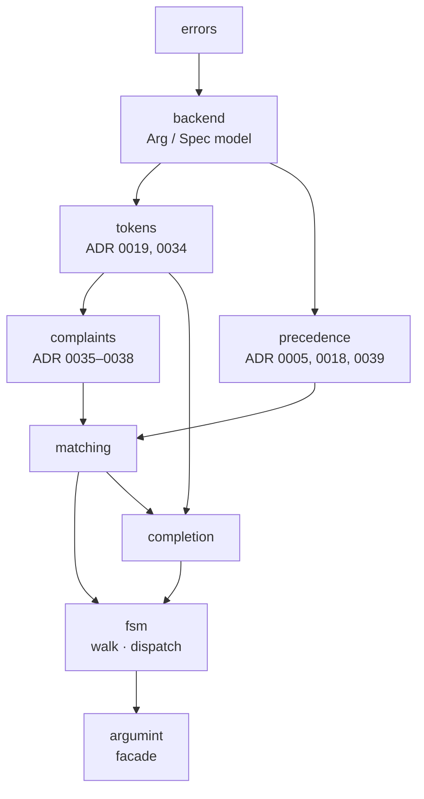

# Deepening map, 2026-08-28

The first pre-1.0 architecture review: seven deepening opportunities in the
internals, lettered A–G. Six shipped; F is parked. The next review,
[2026-09-24](2026-09-24-pre-1-0-review.md), continues the lettering at H.

Vocabulary: domain terms per [`CONTEXT.md`](../../CONTEXT.md); architecture
terms (module, interface, depth, seam, adapter, leverage, locality) as
defined in the `codebase-design` skill. Line numbers are as of the review
date and have since drifted.

## Status

| | Candidate | Status | Landed as |
|---|---|---|---|
| [A](#a--the-token-layer-has-no-module-and-no-interface) | The token layer has no module | Shipped | #61, PR #62, `6d01e30` |
| [B](#b--failure-reporting-is-scattered-across-fsmnim) | Failure reporting is scattered | Shipped | #63, PR #64, `db363aa` |
| [C](#c--the-value-tiers-are-passed-as-closures) | The value tiers are passed as closures | Shipped | #65, PR #66, `3b1fa4b` |
| [D](#d--three-arg-methods-answered-one-question) | Three `Arg` methods answered one question | Shipped | #59, PR #60, `e6a6d69`, ADR 0046 |
| [E](#e--help-layout-is-one-77-line-proc) | Help layout is one 77-line proc | Shipped | #67, PR #71, `01c4032` |
| [F](#f--backendnim-holds-two-unrelated-data-models) | `backend.nim` holds two data models | Parked | — |
| [G](#g--shell-completions-fsm-walking-half-has-no-module) | Completion's FSM-walking half has no module | Shipped | #78, PR #80, `6a90df3` |

Order taken: D (the only one with a 1.0 deadline, since it changed exported
methods) → A (prerequisite for B and C) → B → C → E → G. F stays parked.

## The shape of the problem

The public interface was already deep: `parse(spec, args)` hides an FSM
compiler, a backtracking walk, four value tiers and a dispatch tree behind
one call. The friction was internal navigability. Several concepts had no
module, so they were spread across a file rather than named by one.

`fsm.nim` was 1,001 lines holding six concerns, three of them split across
non-adjacent regions:

| Lines (approx.) | Concern |
|---|---|
| 158 | types, `ParseContext` (13 fields) |
| 105 | complaints, `osaDistance`, `didYouMean` |
| 142 | token shape and classification |
| 13 | `push` |
| 35 | `resolveEnv`/`resolveConfig`, `probe` |
| 48 | leftovers, `addStarved` |
| 201 | `match`, `reach`, `walk` |
| 181 | shell completion |
| 74 | dispatch |
| 56 | `formatComplaints`, `finalComplaints` |
| 85 | `applyTier`, `applyFallbacks` |
| 60 | `parse*` entry point |
| 256 | tests (Value Precedence tiers only) |

The proposed end state, which is what shipped:



Each new module lands on ADRs that already existed as prose. The layering
was already acyclic; the splits gave the layers names. (`matching` was added
by G; see below.)

## Candidates

### A — The token layer has no module and no interface

**Shipped** 2026-08-28 as issue #61, PR #62, squash `6d01e30`. No ADR.

`RawToken`, `Classification`, `classify`, `consume`, `isOptShape`,
`isNonOptionShort`, `exemptFromStrict`, `mustResolve`, `refusesAsValue`,
`refusesAsPositional`, `consumeOptsEnd` and `tokenizeArgs` together *are*
ADR 0019 (lazy classification) and ADR 0034 (Strict Option Checking), plus
the Non-Option Short and Short-Option Cluster glossary entries. They were
loose procs, each re-threading the same three pieces of state by hand, with
no direct tests: the Non-Option Short exemption, the cluster peel and the
strict refusal were verified only through full-parse error strings.

Before: seven call sites passing four arguments each.

```nim
classify(pc.spec, pc.tokens, pos, pc.optsEnd)
classify(pc.spec, pc.tokens, 0,   pc.optsEnd)
# ...five more
pc.consume(pos, c)
pc.consumeOptsEnd(pos)
pc.refusesAsPositional(pos, c)
pc.spec.refusesAsValue(tokens[pos+1])
```

After: one cursor, three operations.

```nim
TokenCursor = object
  tokens:  seq[RawToken]
  spec:    Spec
  optsEnd: bool

cur.classify(pos)      # ADR 0019
cur.consume(pos, c)    # peel / delete / reinsert
cur.refuses(pos, c)    # ADR 0034
```

- **Locality:** one file answers "what is this token, given where we are".
- **Leverage:** the walk names three operations instead of twelve procs and
  four repeated parameters.
- **Tests:** "`-1.5` against a declared `-1` flag leaves `-.5` refused, not
  exempt" becomes a direct assertion instead of a substring match on an
  error page.

**As shipped:** `tokens.nim` owns everything above, keyed on `TokenCursor`,
and `tests/test_tokens.nim` (later moved into `tokens.nim`'s own test block)
pins the rules directly.

**Correction:** the review claimed `refusesAsValue` and `refusesAsPositional`
were "the same rule keyed two ways". They are keyed differently but are not
the same rule: dropping the kind guard regresses ADR 0034's headline
`--name --port` case. Both were re-keyed onto the cursor without merging.

### B — Failure reporting is scattered across `fsm.nim`

**Shipped** 2026-08-29 as issue #63, PR #64, squash `db363aa`. No ADR.

About 210 lines implemented five rules (ADR 0035 parse-failure reporting,
0036 rank by Reach, 0037 missing-argument suppression, 0038 name the short
option, and Did-You-Mean) in four non-adjacent regions. `osaDistance`, a pure
Damerau–Levenshtein, sat 800 lines from `formatComplaints`, which renders
what it decides. Suppression rules were split by where they fire: ADR 0037's
terminality rule inside `match`'s Argument arm, the catch-all's silence in
the Options arm, the rest in `finalComplaints`. The suggestion threshold
`min(2, max(1, n div 4))` had no direct test.

| Region | Held |
|---|---|
| 25–38 | `Complaint`, `Leftover` |
| 159–263 | `didYouMean`, `unknownOption` |
| 457–504 | `addLeftover`, `addStarved` |
| 964–1019 | `formatComplaints`, `finalComplaints` |

Proposed: a `complaints.nim` with a `Report` that records during the walk
and words the failure after it.

```nim
# during the walk: record, don't word
report.missing(kind, subject)
report.leftover(cursor)
report.starved(cursor): bool
report.merge(other)      # Reach tie

# after the walk: word, then render
report.render(spec): string
```

- **Locality:** every suppression rule in one file, next to the renderer.
- **Leverage:** `walk`'s loop shrinks to Reach ranking plus merge-or-replace.
- **Tests:** `didYouMean` becomes testable as the pure function it is.

**As shipped:** `Report` replaced four loose `ParseContext` fields
(`messages`, `errorTokens`, `errorSpec`, `errorCommand`) with verbs:
`missingOption`/`leftover`/`starved`/`merge`/`adopt` during the walk,
`finalComplaints`/`failureMessage`/`raiseParseFailure` after it. The Value
Precedence sweep uses the same `Report`. Direct tests pin `osaDistance`,
the threshold and every suppression rule. Code review found two dead pieces
now removed: `backend.nim`'s unused three-argument `raiseParseError`, and
`withUsage`, folded into `complaints.nim`, its only consumer.

### C — The value tiers are passed as closures

**Shipped** 2026-08-29 as issue #65, PR #66, squash `3b1fa4b`. No ADR.

`ValueCursor` was tier-agnostic, taking a `resolve: proc (): Option[seq[string]]`,
but there were exactly two tiers, both compiled in, with resolvers defined
fifteen lines above. Every call site built closures, including a
`let spec = pc.spec` workaround because a closure can't capture a
`var ParseContext` parameter. This was the only part of `fsm.nim` with unit
tests, which needed a `TestArg` subclass invented inside `isMainModule`:
256 lines of tests living in the implementation file because their module
didn't exist yet.

Before:

```nim
let spec = pc.spec
if pc.env.probe(m.opt, () => resolveEnv(m.opt, spec)):
  return true
if pc.configValues.probe(m.opt, () => resolveConfig(m.opt, spec)):
  return true
```

After:

```nim
if pc.tiers.probe(m.opt, pc.spec):
  return true
let complaints = pc.tiers.apply(pc.levels)
```

- **Locality:** Value Precedence's rules (oversupply, cross-level dedup,
  env-before-config) in one file.
- **Leverage:** six closure constructions and one memory-safety workaround
  go away.
- **Tests:** `TestArg` becomes an ordinary fixture in an ordinary test file.

**As shipped:** `precedence.nim` owns `ValueCursor`, `resolveEnv`/
`resolveConfig` and `applyFallbacks`. `fsm.nim` dropped from 1,001 to 588
lines and lost its `isMainModule` block; the 20 tests moved 1:1 to
`tests/test_precedence.nim`.

**Correction:** the sketch gave `ValueCursor` a `tier: SeenBy` field. The
shipped design keeps `ValueCursor` at its original five fields and indexes
it by a new `FallbackTier` enum (`ftEnv`, `ftConfig`, strongest first) in
`Tiers.cursors: array[FallbackTier, ValueCursor]`. That avoids a wrong
`byNone` zero-value default, and turns the env-then-config fallthrough into
one `for t in FallbackTier` loop.

### D — Three `Arg` methods answered one question

**Shipped** 2026-08-28 as issue #59, PR #60, squash `e6a6d69`, recorded as
[ADR 0046](../adr/0046-arg-value-source-contract.md). The only candidate
with a deadline: the methods were exported `{.base.}` methods, so changing
them after 1.0 would have meant a deprecation cycle.

`envName`, `envDelim` and `configKey` all answered "where else can this
Arg's value come from?" and were never consulted apart. Because
`ValueArg[T, multi]`'s two arities are distinct types, the generators
emitted nine methods, every one a bare field read.

| | `envName` | `envDelim` | `configKey` |
|---|---|---|---|
| `ValueArg[T, false]` | generated | generated | generated |
| `ValueArg[T, true]` | generated | generated | generated |
| `FlagArg[T]` | generated | generated | generated |

After: one generated method per type, two in the contract.

```nim
method envSource*(self: Arg): Option[EnvSource] {.base.}
method configKey*(self: Arg): ConfigKey {.base.}
proc envName*(self: Arg): string   # derived, not dispatched
```

**What changed against the proposal:** the card first proposed one
`valueSources` record. Grilling rejected it: the Env Source and Config Key
tiers are deliberately asymmetric in `CONTEXT.md`. It also found that
`ValueArg.env` was already `Option[EnvSource]`, so `envName`/`envDelim` were
one field that had been split. A scratch compile then found the real defect:
the methods were overridable but not readable from a caller's module, the
opposite of what ADR 0030 said. Both are fixed; ADR 0030 carries a
correction.

### E — Help layout is one 77-line proc

**Shipped** 2026-08-30 as issue #67, PR #71, squash `01c4032`. No ADR.

`genHelp` did group ordering, column-width computation, annotation
assembly, two `wrapWords` passes and a line-by-line zip in one proc nested
five deep. Four rules (the `[choices: …; default: …; env: …]` bracket and its
order, the `[action: …]` divergent-flag rule, the `maxVariantsWidth` cap,
and the 2-vs-4-space margins) each had a paragraph in `architecture.md` and
no name in code. The test surface was one 42-line file of whole-page string
assertions.

```
genHelp
└ for group in groupOrder
  └ for arg in groups[group]
    └ for vg in variantGroups
      ├ annotations assembly
      ├ bracket / primary / text
      ├ two wrapWords passes
      └ for j in 0 ..< max(vLines, tLines)
        └ margin / indent zip
```

Proposed:

```nim
proc annotations(arg: Arg): seq[string]            # validator; default; env; configKey; action
proc rows(arg: Arg, colWidth: int): seq[Row]       # one Row per variant group
proc render(rows: seq[Row], width, colWidth: int): string  # wrap + zip + margins
proc genHelp(spec, command): string                # prolog · usage · groups × rows · epilog
```

- **The interface is the test surface:** the annotation order becomes a
  one-line assertion on `annotations`.
- **Locality:** wrapping and zipping, the part with real edge cases, is
  isolated from the annotation rules.
- **Leverage:** changing the bracket separator no longer means re-reading
  a five-deep loop.

**As shipped:** built test-first (red-green-refactor) rather than the
motion-then-tests shape of A–C, as one commit. 42 new direct tests in
`help.nim`'s own test block (778 → 820 checks). Found along the way:
`rows`/`variantsColWidth` had re-implemented `variantGroups` inline, and
`render` wrapped the whole prefixed line instead of the text alone. Also
found that `nimble test` never compiled `help.nim` itself, so its embedded
suite never ran. Three existing quirks were pinned rather than fixed, and
filed: bare `"Usage:"` for an empty usage string (#68), the epilog glued to
the last row (#69), and overlong words desyncing variant/text pairing (#70).

### F — `backend.nim` holds two unrelated data models

**Parked.** Files: `backend.nim` (graph types), `fsmgraph.nim`.

`backend.nim` carries the Arg/Spec domain model and the
`State`/`Transition`/`Matcher` graph model. A previous split moved the graph
operations to `fsmgraph.nim` but left the types behind, so `fsmgraph` is a
module of verbs whose nouns live elsewhere.

| Today | After |
|---|---|
| **backend:** Arg, Spec, SpecSettings, State, Transition, Matcher, PEGs, `formatUsage`, `arbitrate` | **backend:** Arg, Spec, SpecSettings |
| **fsmgraph:** operations only | **fsmgraph:** State, Transition, Matcher and their operations |

The deletion test is only weakly satisfied. `Matcher` names `Arg`, and
`fsmgraph` already imports `backend`, so the move is mechanical rather than
clarifying. `architecture.md` §0 documents the current line deliberately.
Revisit only if `backend.nim` grows again. (The
[2026-09-24 review](2026-09-24-pre-1-0-review.md) finds it has, but proposes
pulling other concerns out rather than this one.)

### G — Shell completion's FSM-walking half has no module

**Shipped** 2026-09-08 as issue #78, PR #80, squash `6a90df3`. No ADR.
Added to the map 2026-08-30.

The end-state diagram above always put `Frontier`/`candidateWords` in
`completion.nim`, but that move never had its own card. `fsm.nim` lines
268–448 (`Frontier`, `collectFrontier`, `CompletionCandidate`,
`bareVariants`, `describeVariants`, `addUnseen`, `candidateWords`,
`pendingOptionalArgs`, `completeArgs*`) were a self-contained concern
(ADR 0012, 0022) inside the walk engine's file, while `completion.nim` held
only the per-shell script generators.

The blocker was a real import cycle: `collectFrontier` calls the walk
engine's own `match`, and `parse*`'s `__complete` short-circuit calls
`completeArgs`. Moving completion out as drawn would make `completion`
import `fsm` while `fsm` imports `completion`.

| Before | Shipped |
|---|---|
| **fsm:** walk, match, dispatch, Frontier, collectFrontier, candidateWords, completeArgs* | **matching** (new): Match, MatchTable, Reach, Level, ParseContext, push, match |
| **completion:** genCompletionScript* only | **fsm:** reach, walk, dispatch, parse* |
| | **completion:** Frontier, collectFrontier, candidateWords, completeArgs*, genCompletionScript* |

**As shipped:** `matching.nim` holds exactly the primitives `walk` and
`collectFrontier` share, so neither `fsm` nor `completion` imports the
other's internals; only `fsm`'s one `__complete` call site reaches into
`completion`. `fsm.nim` is now only the walk/dispatch engine. Code review
caught `architecture.md` going stale, fixed before merge.

## Not proposed

Nothing here contradicts an existing ADR. `ValueArg[T, multi]`'s double
generation is forced by Nim, not a design choice. `Arg.action`'s dependency
inversion is documented as measured and kept (`architecture.md` §4). The
`argtypes`/facade seam is ADR 0043 and working as designed; it's the model
the splits above followed.
