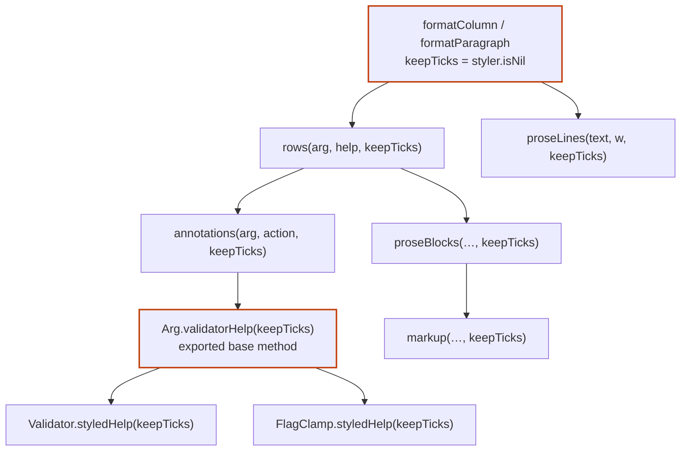
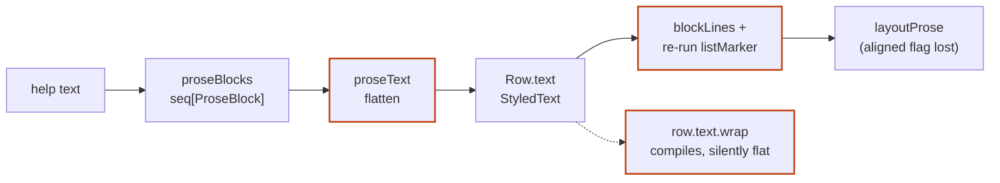
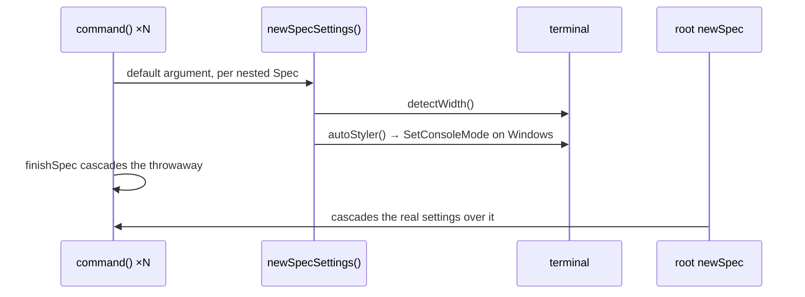
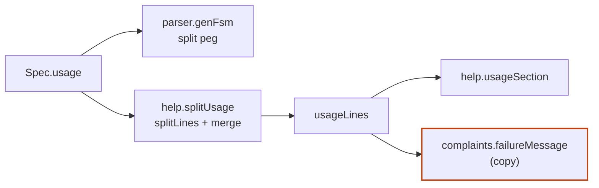

# Pre-1.0 review, 2026-09-24

The second architecture review, run after help formatting and styling landed
and before the 1.0 cut. It continues the [first map](2026-08-28-deepening-map.md)'s
lettering at H. Its focus is what 1.0 freezes: the Help Formatter toolkit,
the methods a custom `Arg` overrides (`parse`, `validatorHelp`), and the
error and message types.

Reviewed at `aab6062`. Vocabulary: domain terms per
[`CONTEXT.md`](../../CONTEXT.md); architecture terms (module, interface,
depth, seam, adapter, leverage, locality) as defined in the
`codebase-design` skill.

## Status

| | Candidate | Strength | Status |
|---|---|---|---|
| [H](#h--resolve-styling-once-inside-help) | Resolve styling once, inside help | Strong | Open, recommended first |
| [I](#i--prose-becomes-a-typed-module) | Prose becomes a typed module | Strong | Open |
| [J](#j--one-shape-for-every-outcome) | One shape for every outcome | Strong | Open |
| [K](#k--settings-live-at-the-root-terminal-probing-in-one-module) | Settings live at the root; terminal probing in one module | Strong | Open (partly a bug) |
| [L](#l--a-usage-line-module) | A Usage Line module | Worth exploring | Open |
| [M](#m--a-contribution-not-an-overloaded-variant-slot) | A Contribution, not an overloaded `variant` slot | Worth exploring | Open |
| [N](#n--env-source-gets-its-own-module) | Env Source gets its own module | Worth exploring | Open |
| [O](#o--which-text-describes-this-variant-lives-on-arg) | "Which text describes this variant" lives on `Arg` | Speculative | Open |

**Recommendation:** H first. It is the only candidate whose friction lands
on both extension points 1.0 freezes (every third-party Help Formatter and
every custom `Arg`'s `validatorHelp`), and it sets up I. Separately, K and J
are small and visible to users (console side effects, escape codes in
`HelpError.msg`), so fix them before tagging 1.0 regardless.

A note on size: `help.nim` (1,630 lines), `style.nim` (739) and
`complaints.nim` (877) are mostly embedded tests. Their production code is
about 470, 440 and 390 lines.

## Candidates

### H — Resolve styling once, inside help

**Strong.** Files: `help.nim:194–301, 400–457`, `backend.nim:603`,
`argtypes.nim:255, 258, 330`, `validators.nim:142–162`, `flagclamp.nim:65`.

**Problem.** Whether backticks survive in help text depends on whether
there's a styler, which only help knows. The ticks take up width, so the
choice has to be made where the text is built, and it's passed as
`keepTicks` through about ten signatures. One of them is the exported
`Arg.validatorHelp` base method, so every custom `Arg` carries a
presentation parameter. Every third-party formatter must also know to pass
`keepTicks = styler.isNil` to both `rows` and `proseLines`: the test
formatter `formatShouty` (`tests/test_help.nim`) doesn't, and passes only
because it renders plain.

The `HelpFormatter` interface is one line, `proc (spec, command): string`,
but what a formatter author must know is most of `help.nim`: `helpGroups`,
`rows`, `longOrShort`, `wrapProse` vs `wrap`, `usageLines`, `proseLines`,
`joinSections`, three `settings` fields, the `keepTicks` rule, and how to
rebuild a heading by hand, since `header`/`usageSection`/`proseSection` are
private. `formatColumn` and `formatParagraph` are identical except for which
help text they pick and which row renderer they call.

**Solution.** Give formatters a value built once per render (spec, command,
settings, styler) that returns ready-to-lay-out rows, prose, usage and
headings, with the tick decision made inside it. `validatorHelp` and
`styledHelp` return Help Markup source rather than `StyledText`, and
`markup` runs once, in help.

**Wins.**

- Leverage: a formatter learns one value, not ten procs.
- Locality: the tick rule lives in one place.
- The custom-`Arg` interface drops a presentation parameter.
- The private `header`/`usageSection` duplicates go away.
- `variantsColWidth` stops building every row twice.

**ADRs.** Keeps [ADR 0048](../adr/0048-pluggable-help-formatters.md): the
formatter still owns the whole message; only its toolkit changes. Changes
the shape of the custom-`Arg` contract (ADR 0017, 0046); 1.0 is the last
cheap moment.

### I — Prose becomes a typed module

**Strong.** Files: `help.nim:45–171`, `style.nim:315–441`,
`completion.nim:82`, `Row.text` (public).

**Problem.** [ADR 0055](../adr/0055-reflow-arg-help-text.md) encodes
paragraph and list structure inside `StyledText`: a newline means a block
break, and a leading `srPlain` span means indent and marker. That's a
second language inside a public type. It's built, flattened, then parsed
back:

A formatter that calls `row.text.wrap(w)` compiles but gets flattened
output. `renderColumn` needs `layoutProse`'s private `aligned` flag, which
the public `wrapProse` discards, so a third-party column formatter can't
reproduce Column Style's continuation indent. The rule's halves live in
`help.nim` and `style.nim`, and completion runs a third, ad-hoc pipeline
(`plainMarkup(firstParagraph(...))`).

**Solution.** Pull the re-flow rule (`help.nim:45–171`) together with
`dedentLines`, `firstParagraph` and `markup` into one module that owns a
typed block model (paragraph, list item, indented line, blank) and its own
wrap. `Row.text` becomes that type.

**Wins.**

- About 25 lines of round-trip code deleted.
- Column Style's continuation indent becomes reachable.
- Locality: ADR 0054 and 0055's rules in one file.
- Tests assert on blocks, not rendered strings.

**ADRs.** Amends ADR 0055, which kept `Row.text`'s type for byte
compatibility within 0.x. Pairs naturally with H.

### J — One shape for every outcome

**Strong.** Files: `errors.nim:20–52`, `help.nim:467–473`,
`complaints.nim:342–392`, `argumint.nim:680–702`.

**Problem.** `ParseError` and `ValidationError` keep `msg` plain and carry a
separate `styledMsg`. `HelpError` has no `styledMsg`, so `HelpArg.action`
renders its `msg` with the styler: a program embedding argumint through
`parse` (the recommended entry point) gets ANSI codes in `HelpError.msg`
on a terminal. The test that `genHelp` matches `--help` runs only with
`style = nil`. Stream and styling policy is also spread across
`complaints.quitMessage`, `parseOrQuit` and `HelpArg.action`.

| Type | `msg` | Styled form |
|---|---|---|
| `ParseError` | plain | `styledMsg` |
| `ValidationError` | plain | `styledMsg` |
| `HelpError` | **escape codes when colour is on** | none |
| `MessageError` | plain | none |

**Solution.** Lift `styledMsg` to `MessageError` too, keep every `msg`
plain, and move stream and exit policy out of `complaints.nim` into the one
place that quits.

**Wins.**

- The exception interface stops varying by subtype.
- Locality: one module owns delivery.
- `complaints.nim` stops knowing about stdout.

**ADRs.** Extends [ADR 0051](../adr/0051-help-and-error-styling.md)'s
plain-`msg` rule to `HelpError`, which it missed. Public exception fields
freeze at 1.0.

### K — Settings live at the root; terminal probing in one module

**Strong**, and partly a bug. Files: `argumint.nim:568`,
`specbuild.nim:100–148`, `style.nim:268–313`, `backend.nim:21–22, 285–311`.

**Problem.** `command()` calls `newSpec` without settings, so every nested
command evaluates the default `newSpecSettings()`. That runs `detectWidth()`
and `autoStyler()`, which on Windows calls `SetConsoleMode`. `finishSpec`
cascades the throwaway settings over the nested subtree, and the parent
then overwrites them with its own. A program passing
`newSpecSettings(style = nil)` still changes the console mode once per
nested command.

Terminal capability detection is also split: colour in `style.nim`, width
in `backend.nim`, each with its own `winlean` import.

**Solution.** A nested Spec gets settings only by cascade from the root.
Width and colour detection move into one module that takes its environment
as a parameter, as `wantsColor` already does for its tests.

**Wins.**

- No side effects the caller opted out of.
- Locality: one module answers "what can this terminal do".
- `backend.nim` sheds process and terminal concerns.

### L — A Usage Line module

**Worth exploring.** Files: `parser.nim:258`, `help.nim:342–398`,
`complaints.nim:11, 371–373`, `specbuild.nim:67–69`.

**Problem.** The parser splits a usage string into Usage Lines with
`peg"\n!\s"`; help uses `splitLines` plus a merge of indented lines. They
treat blank lines differently. The labelled usage block is written twice,
in `help.usageSection` and `complaints.failureMessage`, and `complaints.nim`
imports all of `help.nim` just for `usageLines`.

**Solution.** One module owns splitting a usage string into lines and
rendering the usage block; the parser, help and complaints all call it.

**Wins.** One split rule. `complaints` stops importing `help`. Usage tests
stop needing a Spec.

### M — A Contribution, not an overloaded `variant` slot

**Worth exploring.** Files: `backend.nim:479–500, 561–570`,
`argtypes.nim:147–172, 316–323`, `matching.nim:163, 176`,
`precedence.nim:57–63, 145, 153`, `fsm.nim:174–184`.

**Problem.** `Arg.parse(value, variant, seenBy)` is the write seam, and its
`variant` string means different things per caller:

| Caller | `value` | `variant` |
|---|---|---|
| CLI option | typed value | typed spelling |
| CLI flag | variant name | variant name |
| env / Config Source | env or config value | `$VAR` or `a.b.c` (a source label) |
| `put` | typed value | `""` |

`FlagArg.parse` renames its parameters to cope, `backend.subject` decodes
the slot by looking at `seenBy`, and every custom `Arg` must remember to
call `arbitrate`, which the interface can't enforce.

**Solution.** Pass one value object carrying value, variant, source and
label, and move `arbitrate` into a non-overridable wrapper around the
overridable conversion.

**Wins.** Provenance becomes data. `arbitrate` can't be forgotten.
`subject` stops decoding.

**ADRs.** Changes [ADR 0046](../adr/0046-arg-value-source-contract.md)'s
public custom-`Arg` contract. Decide before 1.0 or leave it.

### N — Env Source gets its own module

**Worth exploring.** Files: `backend.nim:101–112, 215–224, 413–449`,
`precedence.nim:65–80`, `configsource.nim`, `tests/test_argumint.nim:1628–2277`,
`tests/test_precedence.nim:13`.

**Problem.** The Config Source tier has a leaf module (`configsource.nim`,
a real seam with two adapters, INI and JSON). The env tier is spread through
`backend.nim`: `EnvSource`, `env`, `toEnvSource`, `EnvListSep`,
`DefaultEnvDelim`, and `splitEnvValue`, whose only caller is
`precedence.nim`. `precedence`'s `probe` and `applyFallbacks` take whole
Specs but read only `settings` and `args`, which is why
`tests/test_precedence.nim` needs `privateAccess(Spec)`. In
`tests/test_argumint.nim`, the Environment variables (~310 lines) and
Config Source (~340 lines) suites are near-copies of each other.

**Solution.** Mirror `configsource.nim` with an env module, narrow
`precedence`'s parameters to settings and args, and run one test body over
`FallbackTier`.

**Wins.** `backend.nim` sheds another concern. Precedence tests drop
`privateAccess`. About half the fallback tests go away.

### O — "Which text describes this variant" lives on `Arg`

**Speculative.** Files: `help.nim:246–301`, `completion.nim:62–82`,
`backend.nim:612`.

**Problem.** `help.rows` shows the Help Text and turns a divergent
`variantDesc` into an `[action: …]` annotation. `completion.describeVariants`
prefers a divergent `variantDesc` over `help.short`. Completion's doc says
it "mirrors" `help.variantsByDesc`, but it doesn't. The difference may be
deliberate, since completion shows one line per variant.

**Solution.** First decide whether the divergence is intended. If it is,
record why; if not, move the rule next to `variantDesc`.

## Smaller findings

Not candidates, but worth a cleanup pass:

- `docs/architecture.md` says six modules use `privateAccess(Spec)`; only
  `specbuild.nim` does now (plus `help.nim`'s test block).
- `formatComplaints` never wraps to `settings.width`, though help does.
- The width floor of 20 is a bare number repeated in `help.nim` with
  different formulas (`renderParagraph`'s effective floors are 18 and 16).
- `fsm.nim` may import `parser` and `configsource` without using them (not
  confirmed with the compiler).
- `dot*(State, proc)` has no callers, and `dot*(tuple)` calls `quit` though
  its name doesn't end in `OrQuit`.
- The `"__complete"` check appears in both `fsm.nim` and `argumint.nim`.
- `tests/test_argumint.nim` (2,277 lines) would split along module seams:
  Commands, Messages (which mixes help rendering, settings cascade and
  width detection), autoFillUsage, and FSM dedup.
